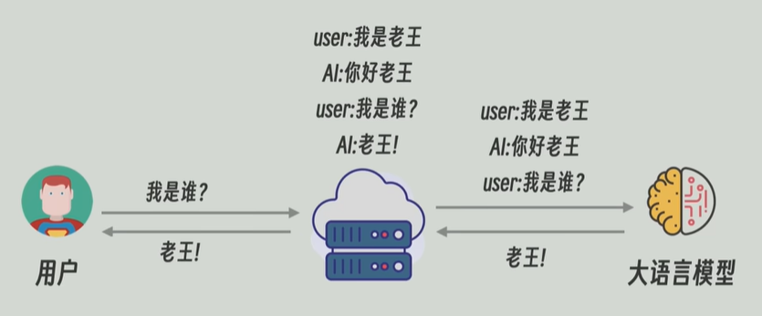

## 一、基础概念
**Agent = LLM + 规划 (Planning) + 记忆 (Memory) + 工具使用 (Tool Use)**。
- 规划：将目标拆成子任务
- 记忆：短期记忆：上下文context；长期记忆：RAG/外部存储
- 工具：MCP

传统LLM只能对话，不能完成一些其他工作比如查询天气等，智能体可以通过工具调用和外部环境进行交互
- 比如用户询问一个问题今天天气怎么样？，agent把问题和自己能用的功能发送给大语言模型，大语言模型返回我要调用这个工具做什么返回给agent，然后agent把前面的东西和调用工具返回的结果再一起发给LLM


#### （2） 和workflow的区别：
如果每个节点都是写死的是workflow，如果中间需要让**系统根据状态动态决定**，那就是agent
- Workflow 负责确定性流程，Agent 负责不确定环境下的动态推进。

#### （3） 什么时候该用prompt、rag、微调、workflow、agent
1. prompt：利用大模型原生通用能力快速完成任务
2. RAG：解决模型知识过时还有缺乏私有知识的问题
3. 微调：改变模型本身的风格、固定格式、特定任务行为
4. workflow：固定顺序的多步任务
5. agent：任务不确定，需要自己决定下一步，能调用工具
- 什么时候做微调？为什么很多模型不是一开始就微调：
	1. 成本高，迭代慢
	2. 风险大
	3. 分清楚用途，微调是改模型本身的能力
	需要模型**固化特定输出格式、领域话术、固定行为**，并且你有足量高质量数据的时候，才做微调。


----
## 二、主流核心架构
#### （一）核心逻辑
##### 1. ReAct
reasoning and acting：是通过prompt，让LLM能够协同生成推理轨迹和行动
- 思想：模拟人类的**思考（Reasoning）** 和 **行动（Acting）**交织在一起
- 流程：（循环进行）
	1. **Thought**：模型先分析当前情况，计划下一步。
	2. **Action**：从工具库中选择一个工具执行
	3. **Observation**：观察工具返回的结果，并将其反馈给模型。
- 使用场景 eg：
```markdown
**提问：上海今天温度多少？比北京高吗？**

**agent推理：**
Thought: 我需要查询上海天气
Action: weather_api("上海")

Observation: 28°C

Thought: 再查询北京天气
Action: weather_api("北京")

Observation: 25°C

Thought: 已经有信息

Final Answer: 上海更高
```
- **典型框架：**
1. LangChain
2. OpenAI Agents SDK
3. LlamaIndex
##### 2. **Plan-Execute**
进阶逻辑，先整体拆解再执行。
#### （二）工程形态
##### 1.多智能体协作(Multi-Agent)
通过让不同的 Agent 扮演不同角色来完成复杂任务
- 协作方式：
	1. 层级结构
	2. 平级通信
	3. 流水线
1. AutoGen
2. CrewAI

##### 2. workflow/DAG
任务变复杂的时候llm自己规划不可靠
- **思想：** 任务流程由用户自己定义，模型按流程走，每个node可以调用LLM/Tool/Agent
- **典型框架：**
	1. LangGraph
	2. CrewAI
	3. LlamaIndex


---
## 三、常用开发框架
>架构和框架：架构是设计图（设计的方法）怎么做，是指导思想；框架是代码工具半成品等，用来做，是现成的工具

agent是**LLM + Planning + Memory + Tools**，agent框架就是解决任务拆解、工具调用、记忆管理、循环这几个问题
##### 1. LangChain
开源的编排框架，是一个开源的Python库，用于开发LLM的应用程序，提供Python和JavaScript库，本质上是一个适用于几乎所有LLM的通用接口，这样就可以拥有一个集中式的开发环境
**把 LLM、Tool、RAG、Memory这些东西抽象成标准组件 **
- **架构：ReAct模式**
- **六大核心组件**：
	1. Models：向多种不同的基础模型提供通用接口
	2. Prompts：提供prompts的框架。langchain中的prompts形式化了提示的组合，无需手动硬编码上下文和查询。eg可以使用Fewshot
	3. Memory：可以选择全部对话或者只保留到目前为止的对话摘要
	4. Indexes/Retrieval（索引和检索）：eg文档加载器，从文件存储服务等来源导入数据源；向量数据库；文本分割器
	5. Chains（链）：一个函数的输出作为下一个函数的输入，链中的每个功能块都可以使用不同的Prompt、models等
	6. Agents
- 示例：chain:`prompt|LLM|output|LLM2|...`

[LangChain是什么？从零基础入门到精通，看完这一篇就够了 - 知乎](https://zhuanlan.zhihu.com/p/1919781127339620246)

---
##### 补充：LangFlow
基于LangChain的可视化编排工具，前端可视化，后端仍运行LangChain逻辑
用“拖拽流程图”的方式来搭 LangChain 应用

---
##### 2. LangGraph
LangChain 官方出的 Agent 工作流框架，**用图来控制**Agent的行为。解决循环和多智能体Multi-Agent的复杂逻辑
- 示例：`一个图，A -> B -> 思考 -> 如果不行回到 A -> 如果行去 C`，支持分支和循环迭代的任务
##### 3. CrewAI
基于python的**多智能体编排框架**
**擅长构建协作式智能体团队**，就像人类的团队一样。每个agent有各自的目标、工具和职责，将它们组织为一个成为crew的结构。这个crew共同完成复杂的任务
- 特点
	1. 基于角色的智能体设计：每个agent分配一个角色，进行协调，给每个角色一个**详细的背景**（eg：“你是一个拥有 20 年经验的资深架构师，性格严谨...”）
	2. 自动任务委派，当agent干不了这活的时候自动问别人
	3. 工具集成（tools）
	4. 记忆系统：内置三种记忆
		1. 短期记忆：上下文
		2. 长期记忆：过去执行成功的经验
		3. 共享记忆：团队成员之间的共享信息

- **四大核心组件**
	1. Agent：员工，关键参数有`role` (头衔), `goal` (目标), `backstory` (人设/Prompt)等
	2. Task：`description` (做什么), `expected_output` (做成什么样)
	3. Tools：比如：搜索工具、PDF读取器、数据库接口
	4. Process：Sequential (顺序流水线) 或 Hierarchical*(领导查收模式)
##### 4. AutoGen

##### 5. LlamaIndex
##### 6.Dify / Coze (扣子)：可视化框架
低代码/零代码拖拽式平台
###### (1) Coze
是目前市面上门槛最低、上限却很高的 Agent 开发平台
Coze 面向“**对话型智能体**”
- RAG：Coze 内置了完整的 **RAG 能力**，自动切分 + 向量化，可以配置平台共享存储（默认）和云搜索服务（独享资源）
- Plugin（插件/工具调用）：低代码版MCP/Tool Calling
- workflow：（工作流）不同节点，A节点的输出就是B节点的输入，依次类推。
	可以用workflow实现：Router(意图分类)，条件分支、多步推理、子流程嵌套......
这类平台通常可以用 workflow 与 plugin 组合出 Router、Agent 和 RAG 等常见链路。
###### (2) Dify
Dify 面向“可调用的应用服务”，偏向于工程落地
提供BaaS解决方案，可以直接把应用以API的形式集成到其他业务系统

---
##### 补充：BaaS
Backend as a Service（后端即服务）
把原本要自己写、自己部署的后端能力直接变成现成的云服务给你用
- eg：以前要自己写用户系统、数据库、鉴权、接口服务......用BaaS的话这些全都直接用现成的API
- 
```
┌─────────────────────────────────────────────────┐
│                  客户端层                        │
│  ┌─────────┐    ┌─────────┐    ┌─────────┐      │
│  │   iOS   │    │ Android │    │   Web   │      │
│  └─────────┘    └─────────┘    └─────────┘      │
└─────────────────────────────────────────────────┘
                       │
                   API网关
                       │
┌─────────────────────────────────────────────────┐
│                 BaaS服务层                       │
│ ┌─────────┐ ┌─────────┐ ┌─────────┐ ┌─────────┐ │
│ │用户认证  │ │ 数据存储 │ │ 推送服务 │ │ 文件存储 │ │
│ └─────────┘ └─────────┘ └─────────┘ └─────────┘ │
│ ┌─────────┐ ┌─────────┐ ┌─────────┐ ┌─────────┐ │
│ │实时通信  │ │ 云函数   │ │ 分析统计 │ │第三方集成│ │
│ └─────────┘ └─────────┘ └─────────┘ └─────────┘ │
└─────────────────────────────────────────────────┘
                       │
┌─────────────────────────────────────────────────┐
│                基础设施层                        │
│    数据库集群 | 消息队列 |  缓存系统  | 存储系统    │
└─────────────────────────────────────────────────┘
```
----

| **框架**         | **核心定位**             | **优缺点补充**                                                                                      | **适用场景**                                |
| -------------- | -------------------- | ---------------------------------------------------------------------------------------------- | --------------------------------------- |
| **AutoGen**    | 多智能体对话 (Multi-Agent) | **优**：对话模式极其灵活。**缺**：容易陷入死循环，Token 消耗极快。                                                       | 复杂策略博弈、代码自动生成与测试。                       |
| **LangGraph**  | 状态机工作流 (Stateful)    | **修正**：它是 LangChain 的进化版，**核心是“循环控制”**。它让 Agent 行为可预测、可复用。                                     | 需要严谨逻辑、人工干预 (Human-in-the-loop) 的企业级流程。 |
| **CrewAI**     | 角色驱动 (Role-Playing)  | **补充**：引入了 **Process（过程）** 概念。它模拟一个公司团队，甚至有“经理人”角色来协调。                                         | 营销方案策划、内容创作团队模拟。                        |
| **Swarm**      | 教育/极简级框架             | **补充**：这是 OpenAI 出的**轻量级示例框架**。核心概念是 `Routine` 和 `Handoff`（像接力赛一样把任务交给另一个 Agent）。              | 简单多步任务、学习 Agent 底层原理。                   |
| **Google ADK** | 谷歌生态深度集成             | **补充**：全称 Agent Development Kit。深度整合 **Gemini** 和 **Google Cloud (Vertex AI)**，支持长上下文和多模态原生处理。 | 强依赖谷歌云环境、需要处理视频/音频原生多模态的任务。             |
| **LlamaIndex** | 数据驱动型 Agent          | **补充**：不仅仅是 RAG，它现在的 `LlamaAgents` 专门处理**基于海量私有数据的复杂查询**。                                      | 知识库深度搜索、企业文档分析。                         |


---
## 四、评估

Agent 的评估不能只看单一准确率。一个实际运行的 Agent 会持续调用工具、受环境状态影响，并可能以多种合理路径完成同一个任务，因此需要同时评价结果与过程。

#### 评估时要考虑什么

1. **过程合理性**：拆解、工具选择和调用顺序是否合理？
2. **环境动态性**：同一任务会因外部状态不同而有不同的最优解。
3. **结果多样性**：允许多条正确路径，不应只按单一参考答案判定。
4. **交互复杂性**：要覆盖外部工具、失败重试、权限边界和多轮状态。

#### 指标矩阵

| 维度 | 可观察指标 | 要回答的问题 |
| --- | --- | --- |
| 功能性 | 任务完成率、准确率、结果质量 | 有没有把任务做对？ |
| 效率性 | 步数、耗时、Token 与工具成本 | 是否用合理代价完成？ |
| 可靠性 | 一致性、鲁棒性、安全性 | 在变动或异常输入下是否仍可信？ |

评估集应覆盖正常路径、边界条件、工具失败、无权限操作、冲突指令和知识库中没有答案的情况。对于 RAG 类 Agent，还应分别检查召回相关性、重排质量、引用是否可追溯，以及“信息不足时能否明确拒答”。


---

# 五、大模型幻觉
- **分为两类**：
	1. **事实性幻觉**：**编造事实**，比如虚构不存在的学术论文法律条文等
	2. **忠实性幻觉**：**歪曲你提供的信息**。在给定上下文/文档的场景下，模型的回答偏离、扭曲或超出了所给材料的内容（如：在 RAG 问答中，文档只写了“产品 A 售价 100 元”，模型回答“产品 A 售价 100 元且附赠一年保修”）
- **原因**：
	1. LLM底层设计原理是基于上下文**预测**“下一个 Token（词）”的概率统计模型，生成的时候是接话而不是求真
	2. 训练数据有**噪声**
	3. LLM过度自信，没有说我不知道的习惯
- **解决方案**：
	1. **RAG**：给模型参考原文让它基于资料回答
	2. **prompt约束**：
		1. 边界明确提示词，要求找不到信息就说不知道，禁止编造。
		2. **思维链（Chain-of-Thought, CoT）与 ReAct**：强制模型在输出最终答案前先写出思考过程，逐步推演，减少直觉性幻觉
		3. Temperature设置的低一点抑制随机性
	3. **多agent校验**：
		1. 把复杂任务拆解成特定的workflow
		2. 引入Critic 节点对上游agent输出的文本进行二轮事实校验
		3. 结构化约束，限制模型的输出格式


---

## 六、上下文工程

上下文连贯对话和记忆
LLM本身是没有记忆的，靠agent来发送

1. 获取全部历史对话：每轮对话把之前的用户和模型的消息一起发给模型（这样会比较消耗token）
2. 滑动窗口记忆：获取最近部分对话的内容（如最近5轮）
3. 摘要记忆：对话变长时让LLM对自己之前的对话做一个摘要
4. 向量记忆：把所有历史对话存入向量数据库（Vector DB），类似于一个RAG，用当前输入去检索相关记忆，把检索记忆拼进prompt
5. 结构化上下文：关键的信息结构化为json
	- eg：工单处理链路`用户输入 → 信息抽取 → JSON → 摘要生成`，关键状态进入 JSON 后可成为稳定记忆
```json
{
  "request": "...",
  "confirmed_facts": ["..."],
  "open_questions": ["..."],
  "next_action": "..."
}
```

**如何设计上下文窗口**
- 设计一个好的上下文窗口：重要的永远保留，不重要的被压缩或丢弃
- 对摘要：
	压缩的模板例如：
```
【目标】
【已确认事实】
【关键决策】
【未解决问题】
【用户的偏好/风格】
......
```

- **常见的模式**
	1. 滑动窗口：最近K轮user/assistant 对话
		上下文窗口结构：`[System Prompt] + [Few-Shot Examples] + [Truncated History] + [Current Query]`
		- `[System Prompt](系统提示词)`:定义模型的角色、用什么语气说话、绝对不能做什么
		- `[Few-Shot Examples] (少样本示例)`:“问题 + 标准答案”的样本对
		- `[Truncated History] (被截断的历史对话)`：通常保留最近的 k 轮对话
		- `[Current Query] (当前问题)`
	2. 历史摘要+最近3~5轮完整对话：当对话历史达到一定阈值（例如10轮）触发一个后台LLM任务将前10轮压缩成一段100字的摘要
	3. 关键信息提取：维护一个json格式的状态注入每次的context里
	4. RAG：对长期对话，历史对话存入向量数据库，提问时每次在数据库里检索最相关的topK个片段作为上下文一起发给发模型


---
## 七、LLM 如何处理长文档
文档太长无法一次性传入大模型
1. 分块汇总：把长文档按照章节或者字数分成几个小块，然后让LLM**对每个小块分析同一个任务**，最后把所有中间结果再全部发给模型让它进行**整体归纳**和逻辑整合
2. RAG：可以用来回答某个特定问题，模型**找到最相关的片段**，但没办法对文档整体理解
3. 扩展原生上下文窗口，在底层改进模型（一般是模型厂商干的）
4. 模型倾向于记住开头和结尾的信息，所以可以在文档中间**重复关键指令**
5. 将旧的文档或对话内容自动总结，**只保留精华**在活跃内存中


---
## 八、提示词工程

#### prompt设计原则
**角色、任务、约束、格式**
- 通常包括
	1. 角色：你是....
	2. 任务：请做....
	3. 步骤：请按以下步骤回答：1.... 2...
	4. 输出格式：请将结果以...输出
	5. few shot：例如，...
```text
【角色】你是一位顶尖的电子产品营销文案写手。   
【任务】为我公司的新款"HydraTech 智能保温杯"撰写一段吸引人的产品特点描述。   
【约束】描述需面向都市白领群体，突出"健康提醒"、"长效保温"、"设计简约"三大核心卖点，语言简洁有力，充满科技感。   
【格式】最终输出为一段不超过 150 字的文案，并额外用` - `列出三个最突出的技术参数。
```


