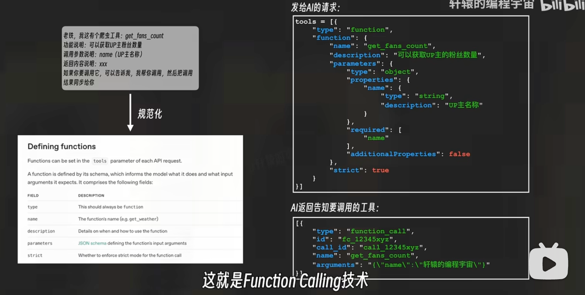
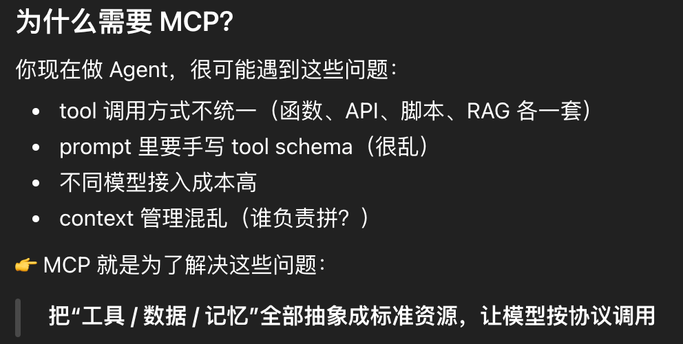
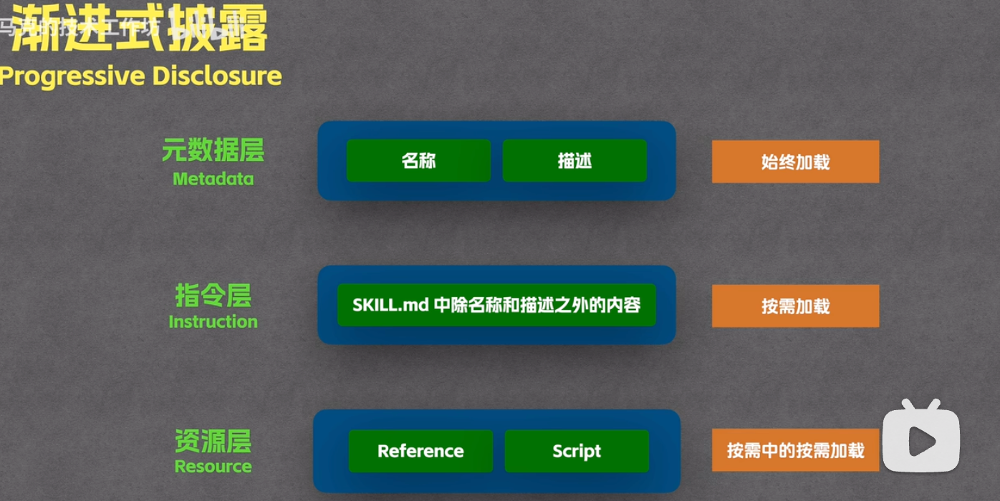
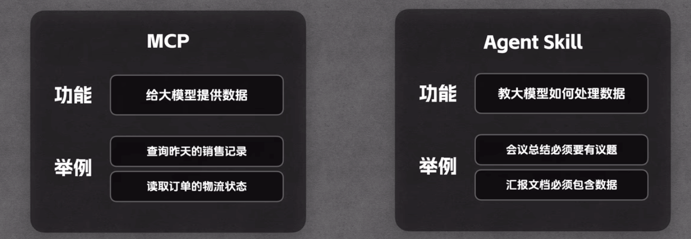

## Function Calling
- 概念：**Function Calling = 给 LLM 一套“可调用能力清单”，让它从“写文本”升级为“做决策 + 调工具”**
	LLM只能基于训练数据生成样本，但是并不知道外部信息，比如问它天气怎么样它没办法知道实时数据。**LLM本质上只能生成文本，不能生成代码。**
- 核心机制：你提供function定义，告诉模型可以调用这些能力；模型做决策决定要不要调用，调用哪个，填参数；模型输出function call；你的系统执行；把结果给模型，然后模型继续生成
	模型决定应该调用哪个函数，并且生成该函数所需的参数

- 步骤：（通过手动或者通过框架处理）
	1. 定义工具：给模型发送一段**JSON Schema**，描述你的函数
		eg：“我有一个函数叫 `get_weather`，它接受一个参数 `city`（字符串）。”
	2. 模型决策：模型分析用户的输入，需要时调用工具
		eg：问今天天气怎么样，它发现自己没办法回答，但是根据你定义的工具`get_weather`可以帮忙
		**模型返回：** 一个特定格式的相应，包括函数名 `get_weather` 和参数 `{"city": "Shanghai"}`
	3. 本地执行：我自己写的代码获得模型的请求之后，在自己的电脑上运行真正的函数获取到结果
		eg：返回"10°C"
	4. 最终汇总：把代码运行的结果返回给模型，模型根据这个结果重新组织语言回答用户
		eg：模型回复“今天气温大约 10°C，记得添衣。”


-----
## MCP 工具
- **定义**：**MCP（Model Context Protocol），模型上下文协议** 
	MCP = LLM 与外部世界交互的“统一协议层”
- **背景**：
	1. 之前使用调用别的服务都需要为每个api编写特定的粘合代码，手动处理
	2. 使用fuction calling要为每个工具函数都写个api schema，并且接口一旦有变化都要重新更新维护
	3. 接口直接暴露也很危险。
	- mcp出现后不用让每个应用对接上千个工具，而是建立一个标准化的插座，实现**即插即用**

- **三个关键组件**：
	1. **主机(Host)**：用户直接交互的界面
	2. **客户端(Client)**：内置在 Host 中，负责与 MCP Server 保持协议通信
	3. **服务器(Server)**：暴露特定功能提供数据访问
		**核心**：
		1. **Resources（资源）**：一个只读窗口，**只能看不能改**，把散落在电脑各处的文档、数据库等变成 AI 随手可查的**知识库**
			eg：读取一个.md文档，或者从数据库读取最新的10条日志等
		2. **Tools（工具）**：提供可执行的函数，调用它会产生实际的后果（发邮件、写文件、改数据库）
			eg：生成文件：`create_weekly_report`（AI 分析完后，调用这个工具直接生成一份 PDF 报告）
		3. **Prompts（提示）**：背景预设
			eg：点击名为 `summarize_support_ticket` 的 Prompt 后，AI 会按预设格式提取问题、影响范围与待办项。
- **工作流程**：
	1. **用户输入**
		eg：“帮我汇总本周的客户反馈，并存入知识库。”
	2. **任务触发**
		eg：LLM 识别出用户意图，发现需要调用 `summarize_feedback` 这个 **Tool**，并先读取 `feedback_records` 这个 **Resource**。
	3. **执行循环**：
		1. Host 发送请求读取 `feedback_records` 这个 Resource，Server 响应并返回结果。
		2. Host 根据看到的数据决定**调用工具**。Host 向 Server 发送 `tools/call`，参数是 `name="summarize_feedback", arguments={"records": "..."}`。
		3. Server执行本地的代码，返回结果给Host
	4. **最终回复**
		eg：“已汇总本周反馈并更新知识库；其中登录问题和导出失败最常出现。”


---

## Agent Skills
- **定义**：类似于大模型的**说明文档+执行逻辑**，通过按需加载解决了上下文空间有限的问题，只有需要的时候才加载
 - **创建文件**：在项目的 `src/skills/` 或 `plugins/` 目录下创建一个新文件夹，文件夹名就是技能名
 - **核心架构**：
```text
my-skill/
├── SKILL.md          # 说明文档定义什么时候用以及怎么用
├── scripts/          # 可执行脚本
├── references/       # 辅助文档
└── assets/           # Prompt 模板、静态图片或 JSON 配置
```

1. skill.md:通过YAML前缀告诉agent自己擅长做什么、当用户提到xxx时加载自己，避免将所有指令塞进prompt从而**节省上下文空间**
	通常包含：
	1. **Metadata** ：元数据，定义技能名称、触发关键词。
	2. **Description**：功能摘要
	3. **Step-by-Step Instructions (SOP)：** 执行逻辑，类似CoT
	4. **Tools & Requirements**：工具与依赖，该技能依赖的脚本或外部 API（如：需安装 FFmpeg）
	5. **Examples** ：少样本示例，Few-Shot
```markdown
---
name: [技能标识名]
description: [一句话描述功能 + 触发场景 + 核心价值]
version: 1.0.0
---

# [技能名称]

## 角色定义
你是一名 [具体角色]，擅长 [核心能力]。

## 核心指令
请严格按照以下步骤执行任务：
1. **分析意图**：[步骤说明]
2. **查阅资料**：如果需要，读取 `references/[文件名]` 获取详细信息。
3. **执行操作**：运行 `scripts/[脚本名]` 处理数据。
4. **输出结果**：按照下方的输出格式要求生成回答。

## 输出格式
- 必须包含：[要素 A]、[要素 B]
- 风格：[专业/幽默/简洁]

## 示例
**用户输入**：[示例提问]
**你的回答**：[示例回答]

## 错误处理
如果遇到 [某种错误]，请 [执行某种操作]。
```
- 运行机制：
	1. **基础用法：按需加载**
		先扫描skill的metadata（描述），如果用户意图与某个skill匹配的话就会加载这个skill的详细指令
	2. **references：补充资料，可以继续缩减skill.md里内容**
		读，把内容加载到上下文里面，消耗token
		eg：在skill.md里写：在提到`钱、采购、报销...`时触发`集团财务手册.md`，指出决定中的金额是否合规
	3. **scripts：运行代码**
		跑，运行代码，不会消耗token
		eg：当用户提到“上传”“同步”“发送到服务器”...，你必须运行upload.py上传到服务器，脚本使用方法 `python upload.py“会议总结内容”`
- 触发逻辑：
	1. 扫描所有skill的metadata
	2. 发现用户想做xxx，匹配到xxx skill
	3. 将该skill的skill.md加载到上下文，通过运行机制运行
	4. 任务结束，清空该skill占用的token空间
- mcp vs skill



----
