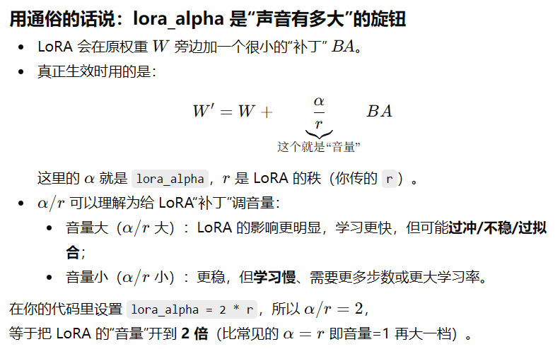

# 模型适配与微调：什么时候该训练，什么时候别折腾

## 模型微调

#### 1.微调方法
- 全量微调
	对所有参数进行更新，更新模型中每一层的权重
- 参数高效微调PEFT
	1. LoRA
	2. QLoRA
	3. Adapter Tuning（适配器微调）
	4. Prefix Tuning / P-Tuning
- 对齐微调
	1. SFT监督微调
	2. RLHF基于人类反馈的强化学习
	3. DPO直接偏好优化

#### 2.过拟合解决方法
过拟合是模型过度学习训练数据的细节和噪声，在测试集上表现差
1. **数据增强**：增加训练数据和类别，比如说对原始图片进行旋转、裁剪、调整亮度等
2. **早停**：监控验证集损失，当损失不再下降的时候停止训练
3. **正则化**：作用于**权重**。在损失函数里添加**惩罚项**：
	1. **L1正则化**：$$Loss_{L1} = Loss_0 + \lambda \sum |w|$$
	- $\lambda$：惩罚力度，设的越大惩罚约狠
	- **$\sum |w|$**：**L1的特征**把所有权重参数的**绝对值**加起来。
	- L1正则化会让很多权重直接变成0，自动过滤没用的噪声特征只留下最重要的特征
	
	2. **L2正则化**：$$Loss_{L2} = Loss_0 + \lambda \sum w^2$$防止某些权重w变得特别大，强迫模型把所有权重w都丫的很小尽量接近0但不等于0
	
	3. **选择**：
		大多时候选L2，明确的知道需要一个稀疏模型的时候（很多权重为0）选L1
4. Dropout：作用于**神经元**。防止所有神经元过于依赖某些大神（超级特征）
	训练的时候：每轮随机暂时的关掉一部分神经元
	测试的时候所有神经元火力全开

#### 3.数据预处理
-  基础与几何
	1. 归一化：将像素值从 [0, 255] 缩放到 [0, 1] 或进行标准化（减均值、除方差）。效果：加速模型收敛，增强鲁棒性
	2. 数据增强：随机翻转、旋转、裁剪、缩放、色彩抖动等。效果：提升模型泛化能力，
- 语义
	目标检测或者分类任务里可能会用裁剪技术将目标主体从原图里裁剪出来**去除复杂背景**

#### 4.LoRA
###### (1) 原理
不直接微调巨大的权重更新矩阵ΔW，而是分解成两个极小的矩阵相乘
- **LoRA**：在原始模型旁边添加小型适配器（低秩矩阵）
- **训练时**：只训练这些小的适配器参数，原始模型参数冻结
- **保存时**：只保存适配器权重（文件很小）
###### (2) Merging
将LoRA适配器权重**合并**回原始模型中
- 数学原理：W_merged = W_original + ΔW
	其中 ΔW = A × B (LoRA低秩分解)
###### (3) lora_alpha：缩放系数
eg：
```python
if model_args.use_backbone_lora:
        model.wrap_backbone_lora(r=model_args.use_backbone_lora, lora_alpha=2 * model_args.use_backbone_lora)
        model.config.use_backbone_lora = model_args.use_backbone_lora
```
- model_args.use_backbone_lora：秩
- lora_alpha=2 * model_args.use_backbone_lora)：**缩放系数** α=2r 的 LoRA


#### 5. QLoRA
- 量化算法
	1. `bnb` (bitsandbytes)传统
	2. `hqq` (Half-Quadratic Quantization) 速度更快但可能不兼容
	3. `eetq` (Efficient Exotic Low-bit Quantization) —— 极致的推理速度
#### 6. DoRA
把原先的权重分解成了方向和尺度两个维度，方向用 LoRA，尺度用少量标量参数

#### 7. LLama-Factory
dataset_info文件：
```json
"数据集别名": {
    "file_name": "multimodal_demo.jsonl",
    "formatting": "sharegpt",
    "columns": {
      "messages": "messages",
      "images": "images"
    },
    "tags": {
      "role_tag": "role",
      "content_tag": "content",
      "user_tag": "user",
      "assistant_tag": "assistant"
    }
  }
```
- formatting：数据集格式
	1. sharegpt：多轮对话和多模态指令微调。通常包含一个 `conversations` 列表，里面由 `from`（角色）和 `value`（内容）组成 
```json
Sharegpt
[
  {
    "id": "chat_001",
    "conversations": [
      {
        "from": "human",
        "value": "请描述这张图片中的主要物体。<image>" 
      },
      {
        "from": "gpt",
        "value": "图片中是一只趴在窗边的橘猫。"
      },
      {
        "from": "human",
        "value": "需要拔掉吗？"
      },
      {
        "from": "gpt",
        "value": "不需要，建议进行充填治疗即可。"
      }
    ]
  }
]
```
	2. alpaca (经典的单轮指令格式):单论问答
```json
Alpaca
{
  "instruction": "识别图中的物体",
  "input": "", 
  "output": "这是一个苹果。"
}
```
	3. generation (纯文本格式):适用于预训练、小说续写
```json
{ "text": "从前有座山，山里有座庙..." }
```
- columns：列映射：告诉框架我的json字段对应框架内部的什么概念
	messages和images在我的json里叫什么
- tags：标签映射
	1. role_tag：role：去找role键判断是谁说的
	2. content_tag：内容键
	3. user_tag：用户键叫什么
	4. assistant_tag：模型键叫什么


---
