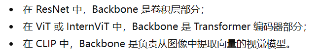
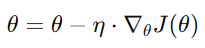
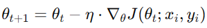
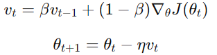
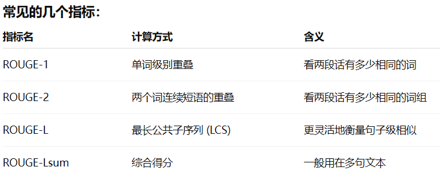
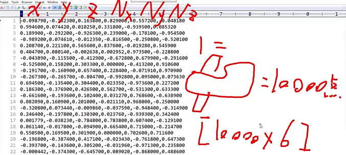

#### （一）模型性能评估方法
##### 1. 零样本评测
无需训练新类别，测试**泛化能力**，模型能否将学习到的知识迁移到未见过的领域或任务上。
- 常见指标
	1. **R@1（Rank-1 Accuracy）** Top-1 准确率：模型预测最可能的类别是否正确
	2. **R@5（Rank-5 Accuracy）** Top-5 准确率：前 5 个预测类别中是否有正确类别
- 应用场景
	1. 图像和文本的跨模态理解：如 CLIP，通过学习图像和文本的共同表示，能够理解未见过的图像或文本描述。
	2. 跨领域推理：模型能否将学习到的知识迁移到未见过的领域或任务上。
##### 2.少样本评测
- 在测试时，为模型提供极少量的任务示例（样本），然后让它根据这些示例来理解和完成新任务。常用于模型的 **快速适应性** 测试。
- 测试模型的**上下文学习能力**——即不更新模型参数，仅通过提供的几个例子就能快速适应新任务的能力。
- 应用场景
	1. 人脸识别：在只有一张人脸照片的情况下，模型能否识别出其他的相似人脸。
	2. 物体检测：在少数物体的样本情况下，模型是否能够识别其他物体。
##### 3.有监督评测/线性探针
- 有监督评测指的是模型在已标注的训练数据集上进行训练，并通过评估模型在测试集上的表现来衡量其性能。
- **线性探针**：模型通常会将 **Backbone（主干网络）冻结**，仅训练一个简单的线性分类器（如全连接层）
- 零样本不更新任何参数；线性探针需要用训练数据更新任务头的参数，但主干保持不变。
##### 4.微调评测
- 利用少量的标注数据进行特定任务的微调，以提高模型在该任务上的性能。微调评测关注的是模型的**适应性**和**学习新任务的能力**。
- 微调过程中，通常会**更新整个模型的权重**，包括backbone 和 head。


#### （二）模型蒸馏

模型蒸馏，全称为知识蒸馏，是一种将大型、复杂模型（称为“教师模型”）的知识和能力，迁移到小型、高效模型（称为“学生模型”）中的技术。
教师模型生成高质量数据集给学生模型不停的练习，过程中对比检验损失率
- **目标**：让“学生”模型在体积和计算速度上接近小模型，但在性能和能力上尽可能接近“老师”模型
- **核心思想**：教师模型提供的不仅仅是**硬标签**（如普通训练：图片标签是 `[0, 1, 0]`（代表是“狗”），学生模型努力让自己的输出也变成 `[0, 1, 0]`。）还有更丰富的**软标签**知识：（如蒸馏训练：教师模型经过复杂的计算输出概率分布 `[0.15, 0.84, 0.01]`（代表有15%的可能性是猫，84%的可能性是狗，1%的可能性是汽车）
	在蒸馏过程中，学生模型的学习目标不再是简单的硬标签，而是去**模仿教师模型输出的这个更平滑、更富含信息的概率分布**
- 例如：InternViT-6B 替换成 通过蒸馏得到的 InternViT-300M”


#### （三）芯片
##### CPU
拥有少量核心，慢但是聪明
- 适合执行普通程序
#### GPU
拥有成千上万个核心但是每个核心相对简单，适合并行处理
- 适合训练AI模型
#### NPU
专精于AI计算，效率极高，但是只能用于AI任务
- 适合部署AI模型（推理）


#### （四） 从未标注数据中自我生成标签来进行训练
- 基于生成式：（填空）
	eg：BERT中的**掩码语言建模**，模型需要根据上下文“我今天要去”和“散步”，来预测被 `[MASK]` 遮盖住的词应该是“公园”
	eg：CV领域中：MAE中的**掩码图像建模**。将一张图片分割成多个小块，然后随机遮盖掉大部分（例如75%）的小块。模型（一个编码器-解码器结构）需要根据那些未被遮盖的、稀少的图像块，来预测并重建出被遮盖部分的像素内容。
	
- 基于对比式：（找同伴）
	eg：CV领域：SimCLR的**图像对比学习**，从一张原图 `X`，通过两种随机数据增强（如裁剪、旋转、颜色变化等），得到两个衍生视图 `X_i` 和 `X_j`。这两个视图互为**正样本对**。同一个批次中，所有其他图像生成的视图都是 `X_i` 的负样本。让模型学会忽略无意义的干扰（如颜色变化、视角变化），而抓住图像的本质语义特征。无论一只猫的图片被如何裁剪、变色，模型都会把它们映射到特征空间中相近的位置。
	eg：多模态领域：CLIP：互联网上天然的图像-文本对就是正样本。例如，一张猫的图片和它的描述“一只可爱的猫”是一个正样本对。

一般流程：
1. 预训练，在海量无标签数据`D_unlabeled`上进行自监督任务
2. 学习到表征，获得一个已经理解了数据基本结构的预训练模型
3. 微调，在一个小规模的、带标签的特定任务数据 `D_labeled` 上进行微调，以适配下游任务（如情感分析、图像分类等）

#### （五） 视觉模型框架
##### backbone
主干网络，负责“看懂图像”，提取有用的视觉特征
- 作用：
	1. 读取图片
	2. 提取低层特征（边缘、纹理）
	3. 提取高层语义（形状、物体概念）
	4. 最终输出一个特征图（feature map）或向量表示（embedding）。
- 举例：
- 通常是一个深度卷积神经网络（如ResNet、VGG）或者视觉Transformer（如ViT），它负责从输入图像中提取多层次的特征

##### Head
利用 backbone 提取的特征，完成具体任务
- 在图像分类任务中，Head 通常是一个全局平均池化层和一个全连接层，输出每个类别的得分。
- 在目标检测任务中，Head 可能会包括区域提议网络（RPN）和分类/回归分支，用于预测边界框和类别。
- 在语义分割任务中，Head 通常是一个解码器，它将Backbone提取的特征图上采样到原始图像尺寸，并对每个像素进行分类。

##### 举例
###### CLIP模型（多模态）
```css
图像输入 → [Backbone(图像)] ViT --提取图像特征
文字输入 → [Backbone(文本)] Transformer  --提取文字特征
   ↓
[Head] 对比学习模块（Cosine 相似度） --让相匹配的图像和文字向量相接近
   ↓
输出：图像-文本匹配分数

```


#### （六）Docker
Docker 是一个“容器化”平台：把你的应用连同运行它所需的一切（运行时、库、配置）打包成一个**镜像（Image）**，运行时变成**容器（Container）**


#### （七） temperature
LLM里控制个性的参数，控制回答随机程度
在生成文字的过程中，模型并不是“直接选最可能的下一个词”，答案更自然、更有变化。
- 低（如0.2~0.4） 回答稳定几乎每次都一样，适合考试题和医学问答等
- 中（如0.6~0.8）回答略有变化更自然，适合对话
- 高（如1.0以上） 回答天马行空，适合创作类任务

#### （八）Top-p采样
只在“靠谱的那一堆词”里随机抽
把候选词按概率从高到低排序，从头开始累加概率，直到累积概率>p，只保留这部分词作为候选池，然后在池里按概率重新抽样
- Top-p决定候选池多大，temperature决定候选池里抽的多随机


#### （九）张量
- 0D张量（标量） 一个点
- 1D张量（向量）一条线上的一串数字
- 2D张量（矩阵）一个表格
- 3D张量（三维张量）一摞表格（比如说视频帧）
- 更高维张量 多层立体结构（多维空间）

#### （十）Adam
梯度下降优化器 能够记忆过去，还能按照维度自适应调步子

#### （十一）SGD 随机梯度下降
Stochastic Gradient Descent，让模型不断调整参数、逐步逼近最优解
###### 梯度下降：

###### 随机梯度下降
不再每次都用全部数据，而是随机抽一小批样本 batch来更新一次参数。

###### 动量版SGD（Momentum）
它会记住上一次的方向，让梯度下降更顺滑，减少震荡。有惯性，方向更稳



#### （十二）pkl文件
pickle模块 二进制文件，下次程序重启还能用
例如在python中有一次字典，想把它保存在硬盘里：
```python
import pickle

with open("data.pkl", "wb") as f:
    pickle.dump(data, f)
    
# 此时生成二进制文件 data.pkl，人看不懂但是 Python 能读回来

with open("data.pkl", "rb") as f: 
    loaded_data = pickle.load(f)

print(loaded_data)
# 输出：{'status': 'ok', 'score': 98, 'tags': ['AI', 'Security', 'RAG']}
```

#### （十三）SoTA
State of the Art：当前最先进的技术水平

#### （十四）E2E-AD
End-to-End Autonomous Driving（端到端自动驾驶）：用一个可联合训练的模型，直接将传感器输入映射为感知、规划或控制输出，减少传统模块化系统中人工定义的中间接口。

#### （十五）logger
用来记录日志信息，有5个核心等级，DEBUG\INFO\WARNING\ERROR\CRITICAL

|等级|说明|场景|
|---|---|---|
|**DEBUG**|调试信息（最详细）|只在开发时打开|
|**INFO**|正常运行信息|程序正常流程提示|
|**WARNING**|警告（不影响程序）|不致命的异常，例如取不到某个值|
|**ERROR**|错误（程序某部分失败）|某个步骤处理失败|
|**CRITICAL**|致命错误（系统崩溃）|服务不可用、严重异常|
- eg：
```python
#创建一个logger名为"data_process.core"，日志级别为debug
logger = logging.getLogger("data_process.core")
logger.setLevel(logging.DEBUG)
```

#### （十六）OpenPyxl
是python里专门用来读写excel文件的库

#### （十七）SDK 
官方工具箱，包含开发某个平台必须的工具、代码、文档

#### （十八）SSE
Server-Sent Events，是服务器主动推送消息给客户端的一种方式
特点：
- **单向**：**服务器 → 客户端**（比如后端 → 浏览器）
- **长连接**：建立一次连接，可以一直用来发很多条消息
- **基于 HTTP**：不用新协议，走的还是普通的 HTTP/HTTPS

（浏览器对服务器说：“我连上你了，你有消息就一直往我这条管道里倒，不用我每次再来问。）

#### （十九）Flash Attention
注意力计算优化方法
1. 分块计算（Tiling）：将注意力矩阵分块，避免存储完整矩阵
2. 在线 Softmax：在计算过程中逐步归一化，减少中间结果存储
3. 重计算（Recomputation）：反向传播时重新计算，而非存储中间结果

在 InternVL 这类视觉-语言模型中，Flash Attention 特别有用，因为：
- 图像 token 数量多（如 256 个图像 token）
- 文本序列可能很长
- 需要同时处理视觉和文本特征
因此，代码会优先尝试使用 Flash Attention，如果不支持则回退到标准实现，保证兼容性。

#### （二十）Pixel Shuffle
上采样技术，通过重排通道维度来**增加空间分辨率**，而不是使用转置卷积或插值。
- 上采样：数据采样率或分辨率增加的过程，常见的方法：
	  1. 插值：插入额外的点或者像素来增大信号的维度
	  2. 图像上采样，
- 下采样：将采样率、分辨率降低的过程

#### （二十一）置信度
模型或系统对某个结论“有多大把握”的度量，数值越接近 $1$，代表系统越肯定自己的判断
- confidence
    - 这份评测结果的置信度，0.0-1.0

#### （二十二）MCP
#### FastMCP
来自fastmcp库，帮助快速搭建工具型MCP服务。它相当于一个“工具容器”，里面可以 mount 各种子工具（local / remote tool）。
`app_mcp = FastMCP(name="app_mcp")`

#### （二十三）视觉-语言对齐层：
##### MLP：
InternVL：视觉特征直接投影到语言空间
	简单、稳定、适合大型模型的快速训练与二阶微调。
	直接把视觉向量线性映射成语言空间
##### Q-Former：
BLIP 系列模型中的：一个小型 Transformer 模块
	通过注意力问图像要语义，让语言 Token 主动问图像
##### 区别：
- **Q-Former 是“智能问图器”**  
    它内部有几十个 learnable “query token”，  
    会对图像进行“询问”：
     “你这张图里主要有哪些物体？”  
     “这个位置有什么细节？”  
     模型通过 cross-attention 自动选取有意义的信息输出给语言模型。  
     所以它的“对齐”是**基于注意力学习的语义对齐**。
- **MLP 是“翻译管道”**  
    它不做注意力计算，只是把每个视觉向量做一次线性投影（换个维度空间）。  
    相当于在说：
     “我不关心图像内部结构，先把这堆视觉向量翻译成 LLM 能听懂的数字格式。”  
     所以它的“对齐”是**基于线性映射的空间对齐**。

#### （二十四）HNSW 索引结构
Hierarchical Navigable Small World graph 分层可导航小世界地图，帮你快速找到相似的向量。它的效率非常高（大约对数级别），是现在最常用的**近似最近邻（ANN）搜索算法**之一。
```
collection_metadata={"hnsw": "cosine"}
```
用HNSW来加速搜索，用余弦相似度衡量语义距离
可以在众多向量中找到最相似的10个向量

#### （二十五）ROUGE 指标
Recall-Oriented Understudy for Gisting Evaluation
得分0~1，越接近1越相似


#### （二十六）温度参数
用来控制输出分布的**尖锐程度**

| 温度值           | 效果        | 分布特点                    | 适用场景          |
| ------------- | --------- | ----------------------- | ------------- |
| **T < 1**（低温） | 分布更**尖锐** | 大值和小值的差距被放大，高概率更高，低概率更低 | 需要明确区分，选择最优选项 |
| **T = 1**（标准） | 标准分布      | 保持原始相对关系                | 一般情况          |
| **T > 1**（高温） | 分布更**平滑** | 大值和小值的差距被缩小，分布更均匀       | 需要探索，避免过早收敛   |

#### （二十七）正则匹配
```
r'内容块\s*(\d+)\s*[:：]\s*'
```
- \s*：匹配0个或多个空白符（空格、换行、tab都算）
- (\d+)：匹配一个或多个数字
- \s*：再来一段空白
- [:：] ：匹配英文冒号或者中文冒号
- \s*：再来一段空白

#### （二十八）Chroma 向量数据库
Chroma是一个开源的向量数据库，用于存储和检索嵌入向量（embeddings）
特点是：
1. 轻量化
2. 可以将数据保存到磁盘
3. 支持快速的相似度检索，便于进行第一步的去重处理
4. 与LangChain等框架无缝集成


## **3D点云**
- 点云分割：把不同类别的物体用不同颜色的框区别出来（判断每个点属于哪个建筑）
- 点云补全：

- PointNet
分类任务:分类、部件分割、场景识别

Eg：一个飞机是由10000个点组成的点云，包括6个值x,y,z,nx,ny,nz(法向量）,使用txt文件存储的


## **深度图**
颜色深浅代表距离远近，越深越近
