## 常见 LLM/VLM 模型
#### 1. Bert
BERT 是一个基于大量英语语料库、以自监督方式预训练的 Transformer 模型。采用Masked Language Modeling (MLM)和Next Sentence Prediction, NSP进行自监督学习（无数据标注）
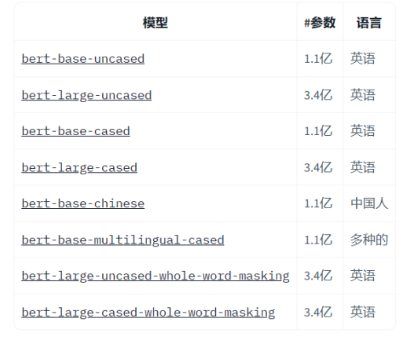

- Uncased：不区分大小写，所有的文本都转换为小写字母
- base/large是基础版本和大型版本的意思
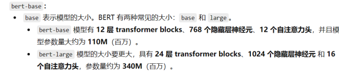
bert-base-uncased 是在大规模英语语料上进行**无监督预训练**后提供的一个基础版本

#### 2. BLIP-2
Bootstrapping Language-Image Pretraining
将预训练视觉模型和预训练大语言模型连接起来进行多模态理解和生成任务
- backbone：通常用CLIP-Vision（如Vit-L/14)
- 对齐模块：冻结视觉和文本编码器，只训练一个轻量级的“中间连接器”**Q-Former**
- 流程：图像 → ViT 提取 patch token → Q-Former 问问题 → 得到 K 个 query embedding → 将其喂给 LLM。

- 预训练过程：
在训练Q-Former时，视觉编码器和文本编码器都是冻结的，只更新Q-Former的参数。
1、视觉-语言**表征**学习：让Q-Former学会如何与冻结的图像编码器有效交互
2、视觉-语言**生成**学习：将Q-Former提取的视觉表征与冻结的LLM连接起来，教会LLM如何基于这些视觉信息进行文本生成

#### 3. VIT
Vision Transformer ，是Transformer模型应用计算机视觉任务的一种神经网络架构
ViT 不使用滑动滤波器处理图像，而是将图像视为一系列图像块，从而能够使用自注意力机制捕获图像不同部分之间的全局关系。

工作原理：
1. **图像分块**: 首先将输入图像分割成固定大小的非重叠网格块。例如，一个 224x224 像素的图像可以被分成 196 个块，每个块 16x16 像素。分成的叫patch，也就是视觉token
2. **Patch Embedding**： 每个patch都被展平为一个向量。然后，这些向量被投影到一个较低维度的空间中，以创建“patch embeddings”。一个可学习的“位置嵌入”被添加到每个patch embedding中，以保留空间信息。
3. **Transformer 编码器**：此嵌入序列被馈送到标准 Transformer 编码器中。通过其自注意力层，模型学习所有补丁对之间的关系，从而使其能够从第一层开始捕获整个图像中的全局上下文。
4. **分类头`[CLS]`**：classification（分类），汇总所有 patch 的信息，代表整张图片的意思。分类任务通常只需 `[CLS]`；需要保留空间细节的任务则会使用 patch token。

VIT的作用： 输入一个图片，图片经过视觉编码器（VIT），被切成一个个patch，做self-attention运算，输出一个高质量的图像特征，包括图片视觉信息和全局语义理解.
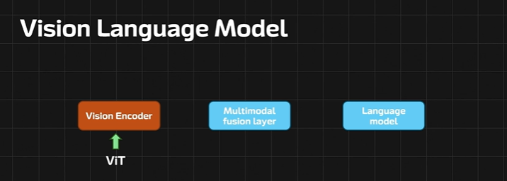

#### 5. CLIP
**Contrastive Language–Image Pre-training**，即 **对比性语言-图像预训练**
突破：Transformer与多模态预训练

- 在 CLIP 出现之前，主流的图像识别模型是在一个固定的数据集（如 ImageNet，有1000个类别）上训练的。它只能识别这1000个预设的类别，缺乏灵活性。如果要识别新物体，就必须重新收集数据并训练模型

- CLIP 不再将图像分类看作一个“从图像到固定标签”的任务，而是看作一个“为图像寻找最匹配的文字描述”的任务。它通过从互联网上收集的 **数亿个“图像-文本对”** 进行训练，从而获得了极其广泛的视觉概念知识

训练过程：
- 取出n个真实的“图像-文本对”
- 分别用图像编码器和文本编码器处理，得到n个图像向量和n个文本向量
- 计算所有图像向量和所有文本向量之间的相似度（比如余弦相似度），形成一个 N×N 的矩阵。
- - **目标函数是：**
	- **正样本对：** 让 **匹配的** “图像-文本对”（即对角线上的元素）的相似度尽可能 **高**
	- **负样本对：** 让 **不匹配的** “图像-文本对”（即非对角线上的元素）的相似度尽可能 **低**

通过这种方式，模型被训练去拉近对应图片和文字的向量距离，同时推远不相关图片和文字的向量距离。最终，模型学会了一个 **共享的、对齐的多模态特征空间**。

#### 6. InternVL 1.0
#### 设计
设计1：扩大视觉模型至6B参数
设计2：渐进式的图像-文本对齐策略
	阶段1-利用海量带噪声的图文数据（5B）进行对比学习预训练，先**建立感知**
	阶段2-利用过滤后的高质量图文数据（1B）进行生成式预训练，再**形成表达能力**
	阶段3-利用高质量Caption/VQA/多轮对话数据（4M）进行SFT训练
		1. Caption（图像描述）：对场景的**完整语义描述**：包括**物体**、**动作**、**场景背景**、甚至**情绪**或**关系**。
			eg：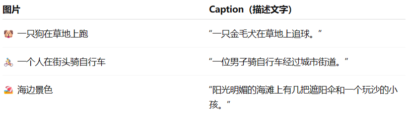
		2. VQA：Visual Question Answering（视觉问答），让模型理解图像的语义内容 + 理解自然语言问题 + 综合推理 → 输出正确的答案。
			eg：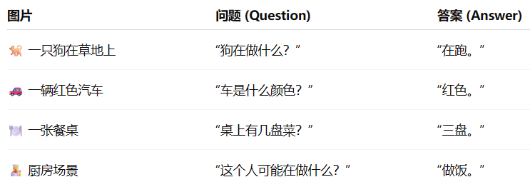
		3. SFT：Supervised Fine-Tuning，（有监督微调）。通常会**冻结视觉编码器**（对于VLM而言），只训练连接视觉和语言的**投影层**以及**语言模型本身**。在一个已经经过大规模预训练的模型基础上，使用少量的高质量任务特定数据集，通过监督学习的方式进行微调
##### 能力评测：
##### InterViT-6B （视觉编码器）
1. 图像分类：
	**探针实验**：在冻结主干（backbone）参数的情况下，只在它输出的特征上训练一个简单分类器（通常是线性层）来做下游任务。
	  实验流程：
		1. 冻结backbone。使用预训练好的模型（如 InternViT-6B）的特征提取分，不更新其权重
		2. 提取特征。将图片输入backbone，得到特征向量或特征图
		3. 训练清凉分类器（探针）。在这些特征上训练一个非常简单的模型（如线性层 Linear Classifier），看能不能区分不同类别。
		4. 评估分类准确率
2. 语义分割：
	 给图片中的**每一个像素**都打上一个类别标签。比如，把图片里所有属于“车”的像素标为红色，所有“道路”的像素标为灰色等。
	 核心指标：**mloU**：
		- Mean Intersection over Union（平均交并比），对于每个类别计算模型预测的区域和真实标注区域的重合程度。范围：0% ~ 100%，越高越好。
		- 假设我们有一个**预测区域**和一个**真实区域**，它们的交集区域就是两者重叠的部分，而并集区域是两者合并后的总面积。
		-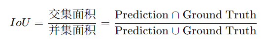
##### InternVL 整体评测
- 零样本评测：在模型从未见过的任务和数据上，不提供任何样例，直接测试其性能。
	1. 鲁棒性零样本分类
	2. 多语言零样本分类
	3. 零样本视频分类
	4. 零样本图文检索评测：模型是否能通过文本描述来检索相关图像，或通过图像来检索相关文本，且没有专门针对该任务的数据。
		eg：R@1（Rank-1 Accuracy）
##### 应用
##### zeroshot多语言内容生成
冻结InternVL Text Encoder（作为特征提取器），只需要训练一个Language Adapter来对齐，就可以实现一个即插即用的图像生成模型
- 只需要用英文数据训练就可以泛化到其他语言
 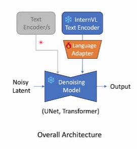
- 印证了InternVL Text Encoder训练之后可以把不同语言的embedding映射到相同的空间上

#### 7. InternVL 1.5
 增强图文多模态对话能力
#### 关键点
1. 主体（强基础模型）：
2. 动态分辨率：可以根据原始图片的分辨率和实际的任务决定要使用多高的分辨率。
		eg：800* 1300的图片，12个模块分成12种长宽比，根据图像原始的长宽比匹配，选择最接近的长宽比896* 1344（都是448的倍数），resize。然后切成6个正方体小块，最后再把原图resize成896* 1344，最后就是7个块。
		-**patch：每一个图像块，都被视作一个“视觉单词”，也就是一个视觉Token**
3. 燃料（高质量数据集）：多语言 多来源 精细标注
4. 下采样操作：相邻的token在通道上合并，448* 448的图像块被分为256个视觉token（原本1024个）

 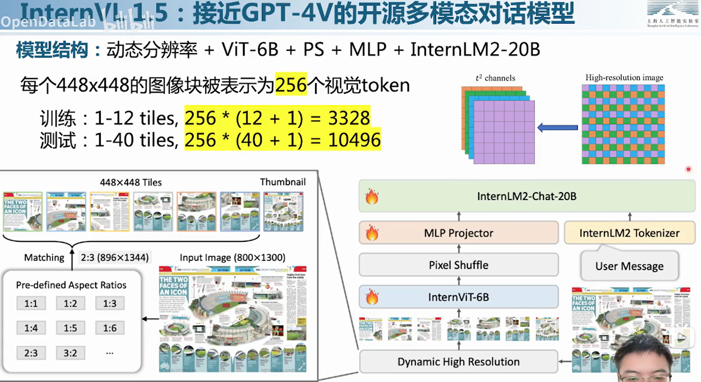
 > +1表示全局缩略块
 
5. 多模态对话数据集
	包括图像描述（caption）、物体检测（detection）、OCR、科学、图标、数学、常识、文档、多轮对话、文本对话等
###### 评估
- convBench：
	- ConvBench 是为了评估大视觉-语言模型（Large Vision-Language Models, LVLMs）在 **多轮视觉对话场景** 中的表现。传统很多评测只看单轮输入输出（例如给图像 + 一个问题 → 模型回答），而现实中的对话是 多轮、上下文有关联、需要跟进记忆、理解图像和历史对话。ConvBench 正是填补这个空白。
	- 分层能力设计：ConvBench 将对话能力分为三个层级：**感知 (perception)，推理 (reasoning)，创造 (creation/creative)**。即先识别图像内容，再在上下文中推理，再基于推理生成创造性回答。
- MMT-Bench
	- MMT-Bench 全称 “Multimodal MultiTask Benchmark”，是一个 **大规模多模态评测基准**，专门用于评估 LVLM 在广泛多模态任务（不仅仅图像＋文本问答，还可能包括定位、导航、专业知识推理等）上的能力。
	- 涵盖 32 核心元任务 (meta-tasks)和 162 个子任务 (subtasks)，任务类型非常广泛，从视觉识别、定位、导航、驾驶、3D理解、情景推理等。

#### 8. InternVL系列：
- 视觉骨干：InternViT / EVA-CLIP，支持动态分辨图、多贴片（patch）（patch 切分 + 缩略图）
- 对齐模块：**MLP Projector** + 少量视觉 LoRA

- 流程：图像 → 切片 +缩略图 → ViT → 投影（MLP） → 视觉 token + [CLS] → LLM。

#### 9. LLaMA
Llama 是 **基于 Transformer 架构** 的预训练模型，具有强大的语言理解和生成能力
##### LLaMA3 
并不是参数量越大性能越好，LLaMA3 8B几乎和LLaMA2 70B的性能一样好
##### LlamaForCausalLM
专门设计用于 **因果语言建模（Causal Language Modeling）** 的任务，它在训练时，任务的目标就是根据输入的文本上下文，生成可能的下一个词，主要用途是进行文本生成、续写、对话生成等任务

#### 10.Phi-3
SLM（Small Language Model，小语言模型），它的参数量比较小，通常只有3B\14B等，微软只给它喂高质量数据，在逻辑推理、数学、写代码方面能吊打比它大得多的模型。但是世界知识缺乏

## 11. BEV 架构

Bird's Eye View（BEV，鸟瞰图）将多摄像头的透视视角转换为统一的俯视空间表示。相对于前视图等透视画面，BEV 更容易表达多相机之间的空间关系，并可用于感知、预测与规划。

常见方案包括 Lift-Splat-Shoot（LSS）和 BEVFormer。

## 12. Lift-Splat-Shoot（LSS）

1. 传统 image-plane 输出与规划所需的 BEV 输出不在同一坐标系。

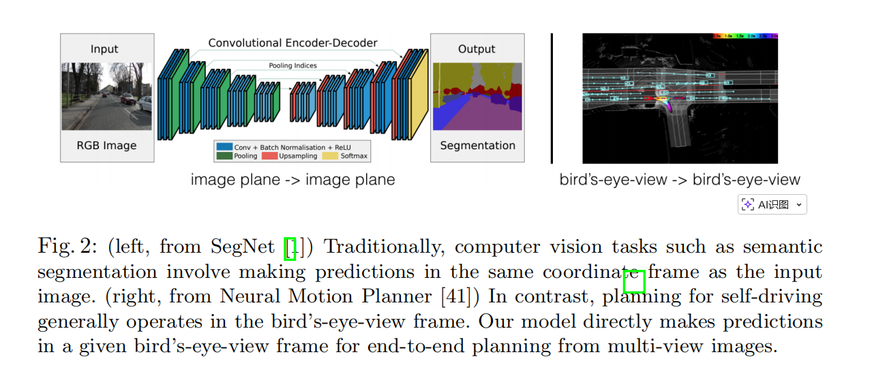

2. 对每个像素，模型沿像素射线在多个深度上分配语义特征；深度概率与像素语义特征组合为 3D 视锥体特征。

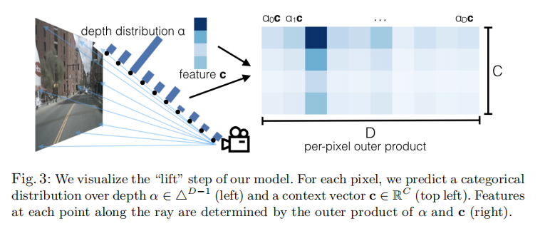

3. 模型将多视角图像经 Lift 操作转为 3D 视锥体特征，再依据相机几何参数 Splat 到统一的 BEV 平面，最后由 BEV CNN 完成感知或规划。

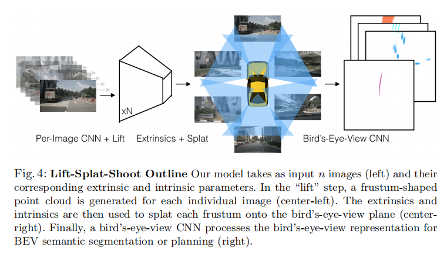

**Lift-Splat-Shoot** 的目标是把所有相机信息统一到同一地面坐标系，使空间关系更容易计算。

- **输入**：多摄像头图像和每个摄像头的标定参数。
- **输出**：一张 BEV 特征图。
- **Lift**：为每个像素预测语义向量 `c` 和深度概率分布 `alpha`，在不同深度形成 3D 视锥体特征。
- **Splat**：将 3D 特征投影并聚合到 BEV 网格柱中。
- **Shoot**：在 BEV 特征上执行检测、分割或规划等下游任务；一种做法是评估候选轨迹在 cost map 上的累计代价并选择最小者。
