# Transformer 与 NLP 基础：注意力到底在注意什么

## Transfomer
计算机理解？由encoder编码器和decoder解码器组成
解决问题：cnn和lstm等无法并行计算的缺点
- **Token与向量**：
	- 把一句话划分为多个词块，每个词块叫一个token，通过语义训练，使词语在多维坐标系里靠的更近
	- 可以进行向量加减法（eg：国王-男人+女人=王后）
	- embedding：eg`[-0.1,-0.2,-0.2]` 模型同时包含**语义和位置向量**
- **QKV**
	- 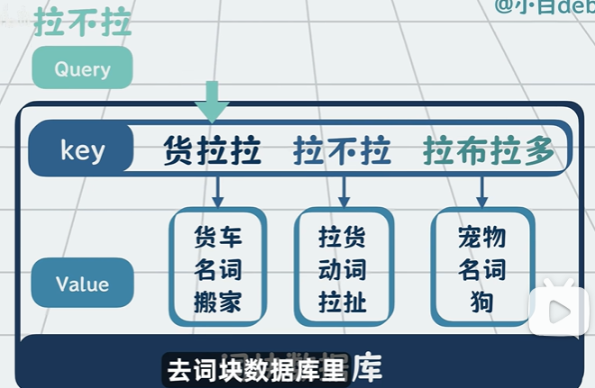
	- Q：query查询向量，查询的问题
	- K：key键，代表token能提供什么信息
	- V：value值，token具体含义
- **Attention（注意力机制）**
	- 公式：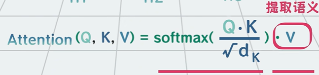
	- 首先Q会遍历所有K，用点积计算相关程度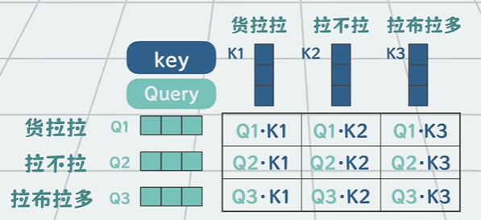
	- 为了避免维度过大导致乘积过大，会除以维度的开方，进行缩放
	- 然后进行softmax，分配权重
	- 最后进行加权求和，获得当前token的上下文感知表示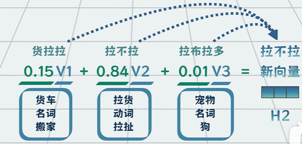
- **多头注意力 Multi-Head Attention**
	并行做多次注意力计算，每次关注不同的侧重点，最终将结果拼接在一起
	- 单个 QKV 只能关注一种关系，比如说语法关系/语义关系。不同 head 可以**专注不同模式**，通过并行的多组 QKV 投影，能够捕捉更丰富的语义与结构信息

- Transfomer之前主流序列转导模型的架构：
	1. 基于RNN/CNN
	2. 使用编码器、解码器
	3. 使用注意力机制增强
- Transfomer结构的创新：
	1. 完全摒弃RNN/CNN
	2. 仍然使用编码器-解码器架构
	3. 完全基于注意力机制

	
## CNN
CNN 是一种“特别擅长看图片”的神经网络：它用卷积在局部找特征、用层级把简单特征组合成复杂概念。
卷积：类似于小的放大镜，就是一个很小的矩阵，在图片上滑动

### FNN 前馈神经网络
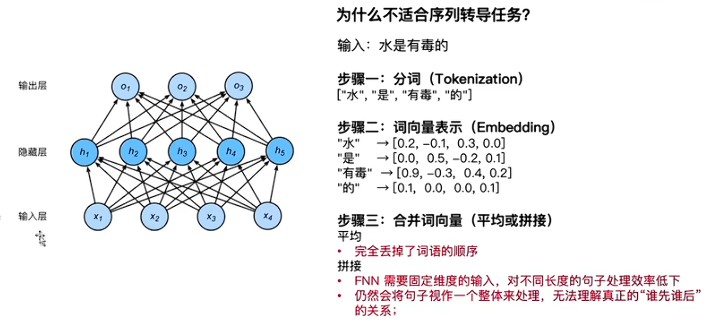
模型无法理解谁先谁后的关系，没有记忆能力，**无法理解上下文**

### RNN 循环神经网络
为处理序列数据设计的网络，引入了**隐藏状态**赋予模型记忆历史信息的能力。
在处理第t个时间步的时候隐藏层的输入不仅包含外部输入x，还有上一个时间步的隐藏状态h
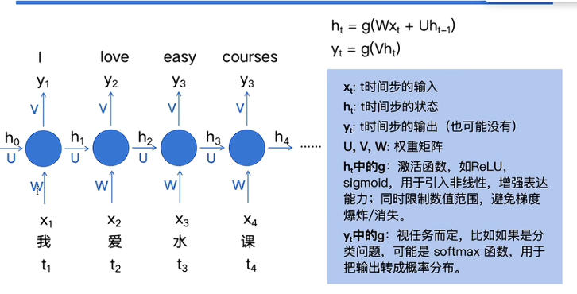t1时刻输入I，输出有两部分一个是隐藏时刻的输出**h1作为后续输入的一部分**，一个是I的**输出结果y1**

### 编码器-解码器
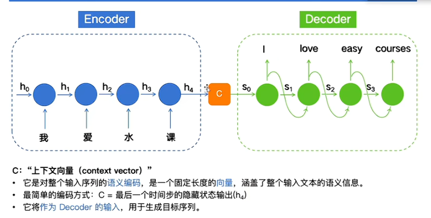
把输入、输出分开来做，编码器只管输入，解码器只管输出
- 编码器最后的结果是c=h4，其实就包含了输入的上下文所有的语义信息，隐式包含了位置信息（一步一步处理的）
- 解码器c作为s0输入

### Attention Mechanism注意力机制
编码器解码器存在者**远距离遗忘问题**以及**不同时间不输入对当前输出的重要性问题**（翻译easy的时候“水”最重要，但是只看“水”可能翻译成water但是“水课”就是easy courses）
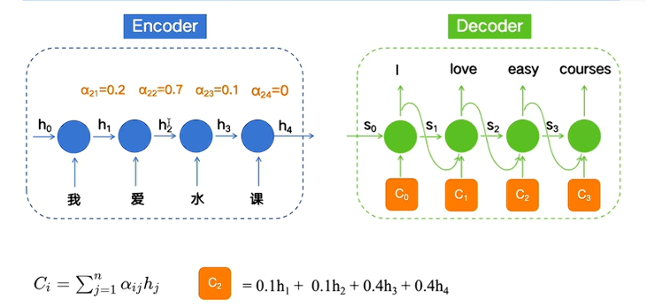
分配不同的**权重**让它注意不同的重点

# Transfomer
##### 编码器：
1. 每个词转换为512维的向量
2.  编码每个词的时候以**全局的视角**看到整个上下文中其他所有词的信息（并行处理每个词，**同时发生**）一口气读完整句
3. 把位置信息也带进去
最终获得了一个矩阵（包含完整含义和逻辑关系）
##### 解码器
1. **自回归**，一次造出一个字，每次生成一个token就加入到已知内容里再去猜下一个字
2. **掩码注意力Masked Attention**：后面内容要加上mask
3. **交叉注意力 Cross-Attention**：每写一个字就会参考编码器的结果

##### 位置编码
Transformer 的Self-Attention 本身是**无序**的，只关心词与词之间的关联强弱但是没有位置信息，所以使用傅里叶变换（正弦余弦交替）
- 最终输入向量 = 词嵌入( token ) + 位置编码( pos )
                         ↑                ↑
                      这词啥意思        这词在第几个
##### QKV
Q：Query - 查询检索需求
K：Key - 键
V：Value - 值
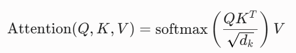输入序列的嵌入向量矩阵为X，模型通过Wq、Wk、Wv与X相乘

1. `Q*K`：计算匹配度，得到一个相关度得分
2.  缩放，除以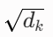：当d很大的时候，①中`Q*K`的结果会很大，很大的把方差控制在1左右，让softmax的梯度更稳定
3. softmax：标准化为和为1的标准化分数
经过上面三步得到权重，所有词对某个token的重要程度，最后再和V做矩阵乘法得到加权平均，得到**带上了上下文信息**的token的新向量

##### Multi-Head Attention
并行做多次注意力计算，每次关注不同的侧重点，最终将结果拼接在一起。单个 QKV 只能关注一种关系，比如说语法关系/语义关系。
不同 head 可以**专注不同模式**，通过并行的多组 QKV 投影，能够捕捉更丰富的语义与结构信息
	eg：Q多样化：附近有名词吗？附近有主语吗？附近有...吗？...

原本是`4*512`,现在是8组`4*64`拼接在一起，然后再经过一个线性层，最终得到`4*512`的结果
- 经过线性层：8个低维的拼接在一起**重新映射成一个高维的**
- 降维本质：多个特征合并成小的语义子空间进行计算
- 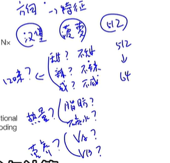

##### Add&Norm残差连接和归一化
**Add** 确保了底层的原始信息不会在深层网络中迷失，而 **Norm** 则确保了在信息流转和相加的过程中，数据的尺度不会失控。
- Add：
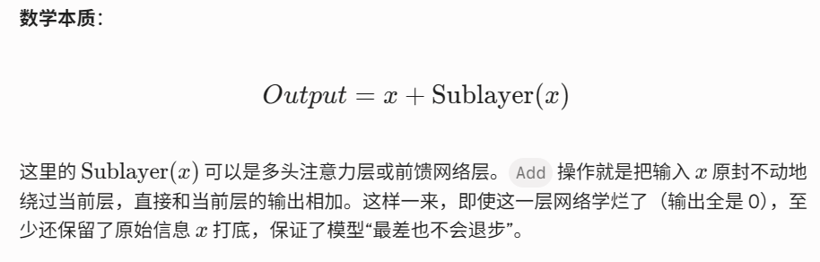
- Norm：
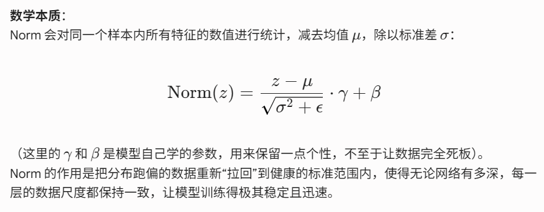

## LSTM
LSTM 引入了 **“细胞状态 (Cell State)”** 和 **“门控机制 (Gating)”**，主动选择记住什么、忘掉什么。
- **遗忘门 (Forget Gate) —— “我们要忘掉什么？”**
    - **操作**：看当前的输入 $x_t$ 和上一步的输出 $h_{t-1}$，输出一个 0 到 1 之间的数（Sigmoid）。
    - **例子**：处理文本时，如果代词从“他”变成了“她”，遗忘门就会把“男性”这个状态忘掉（乘以 0）
- **输入门 (Input Gate) —— “我们要记住什么新信息？”*
    - **操作**：决定哪些新的信息（如现在的单词）值得存入传送带（Cell State）。
    - **例子**：把新的主语“她”和“女性”的特征存进去。
- **输出门 (Output Gate) —— “我们要对外输出什么？”**
    - **操作**：基于当前的细胞状态，决定这一步输出什么隐藏状态 $h_t$。
    - **例子**：如果当前知道主语是单数，输出动词时就要用单数形式。
