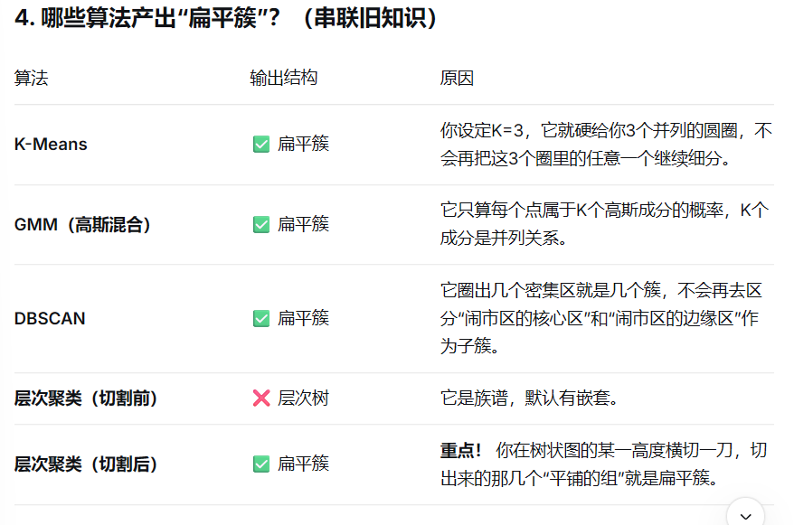
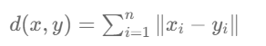
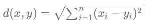
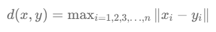
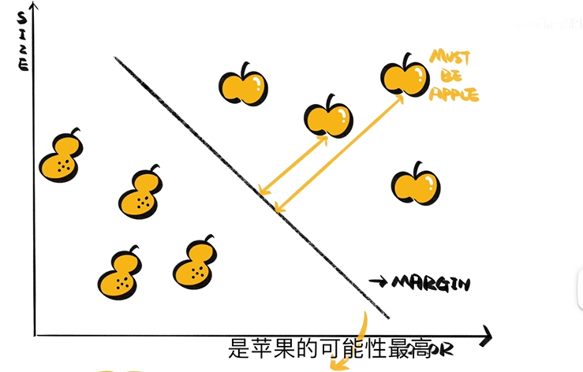
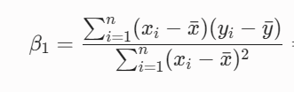
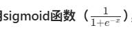
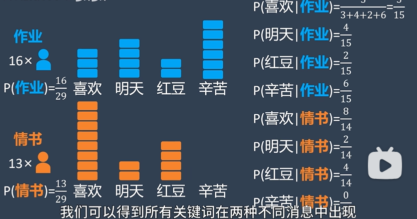
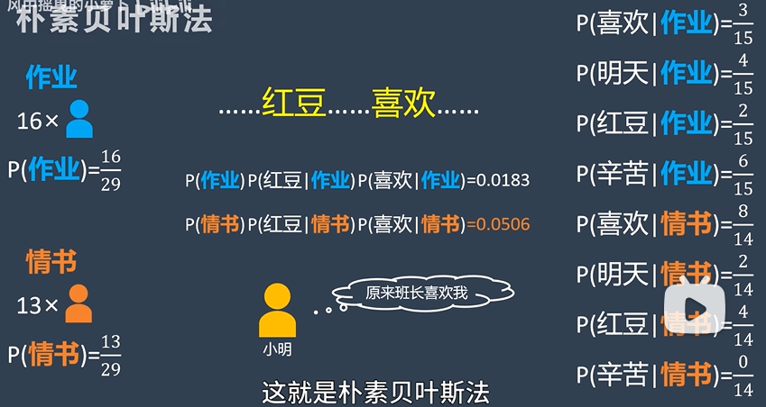
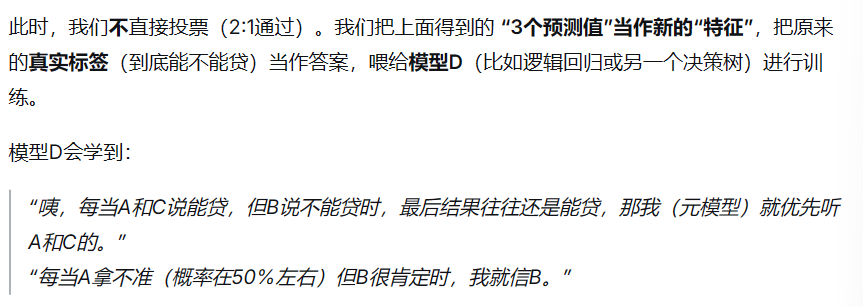

# 常见机器学习算法

##### KMeans聚类
K：想分几组k就是几
Means：均值，每一组的中心水平
有一堆散落的点，蒙着眼随便画几个圈把点分到最近的圈里，然后移动圈的位置到正中心，然后再重新分点...反复几次直到位置基本不动了
- 特点：对初始质心敏感，**对噪声敏感**（因为是均值），鲁棒性差

##### PCA（主成分分析）
在信息损失最少的前提下，把高维数据“压扁”到低维空间，同时找出数据中最重要的几个“核心方向”
找一个好的角度给三维降维成二维（拍照）,找一个能保留最多特征的拍照角度
- 第一主成分：把最长的线拉出来（差异最大的方向）
- 第二主成分：垂直的、第二散开的方向
- 剔除掉高度相关的哪些数据

##### 随机森林
把许许多多棵“**决策树**”组成一个森林，每棵树都独立投票，最终按少数服从多数的原则决定结果（分类），或取所有树的平均值（回归）
能有效抑制过拟合、处理高维数据

##### 监督学习、无监督学习、半监督学习和强化学习
监督学习：**带标签**的数据（有标准答案）
无监督学习：**无标签**的数据（找隐藏模式/聚类）
半监督学习：**少量标签 + 大量无标签**（节省成本，举一反三）
强化学习：试错，**奖惩机制**（动态环境中的决策）

##### GMM 高斯混合模型
经典的**无监督分类模型**
是一种“软划分”的**聚类算法**，假设数据由多个高斯钟形曲线混合而成，通过反复迭代，给出每个样本属于不同类别的概率值，而非硬性归类
- KMeans是硬分类，像拿圆规画圈，这个点离谁近就硬塞给谁，非黑即白
- GMM是软分类：像画椭圆，不仅看距离，还看数据密集程度，给出“属于谁”的百分比。而且它能画出**椭圆形**的簇（因为协方差），比K-means的**正圆形**更灵活
- EM算法：
	- 初始化：初始化均值、协方差、混合权重（**先验概率**）
	- E步Expectation：求每个点属于类别的**期望值**，预测每个点属于不同类别的概率，求**后验概率**（某一个点属于某一个类别的可能性）
	- M步Maximization：通过当前的数据求出**最可能的分布参数**。
		重新计算两个高斯分布的**平均值和方差**，同时更新两个高斯分布的后验概率
	- 重复以上两个步骤直到分类收敛

##### DBSCAN聚类算法
基于密度的聚类，找热闹扎堆的地方
分为：
1. 核心点：半径ε内**至少**有 `MinPts`个邻居
2. 边界点：半径ε内邻居**少于** `MinPts`，但它是**核心点的邻居**
3. 噪声点：既不是核心点，也不是任何核心点的邻居
对参数很敏感，半径ε和MinPts需要调好
- 和Kmeans区别：kmeans只能画圆形，dbscan可以画各种形状

##### 层次聚类
按距离不断合并或分裂，像一个树状图，**不迭代优化某个目标函数**，也不依赖初始中心（它不需要设定初始中心）。它靠的是**距离度量，不是优化**
- 凝聚式（最常用）：自底向上，一开始每个点都是一个簇，不断把最近的两伙连接
	Sklearn默认就是凝聚式
- 分裂式：自顶向下，一开始是一个整体，不断把最不合群的踢出去
层次聚类一般基于相似度/距离做自底向上或自顶向下的贪心合并/拆分，不依赖初始中心

##### 扁平簇
只有一层的分类结果，所有簇之间是并列的关系

##### Bagging
让一群评委分别评价多个**变体数据集**，训练多个独立及模型，最终平均或者投票合并结果
利用**误差相互抵消**的原理治高方差，评委**并行**打分
- 典型代表：**随机森林**
- Boosting：**串行**打分，后一个盯着前一个的错误补救降低偏差，模型权重不平等，准确率高的有重权，对噪声敏感

##### Boost
很多棵决策树，一棵一棵排队建，**后一棵专门去修前一棵的错**，最后大家投票出结果。
决策树一棵树太简单，容易学偏（过拟合），Boosting是先建一棵弱树，看他哪里猜错了，下一棵树专门盯着这些错的地方学，再下一棵继续修，建几十、几百棵，最后加起来，每棵树学的是**上一轮还剩下的误差**，不是重新乱学
- 典型代表：**XGBoost**

##### L1、L2 正则化
给模型罚款
- L1：罚的是绝对值（|w|） （**Lasso套索**），不重要的特征系数被直接打成 0，彻底踢出模型，**删掉废特征**
- L2：罚的是平方和（w²）（**岭回归**），系数被压缩变小，但绝对不会变零。所以 L2 保留了所有特征，只是让它们的影响更温和。

##### 各种距离
- **曼哈顿距离（L1距离）**：只能横着走和竖着走不能斜着走
（向量加减加绝对值）
- **欧氏距离（L2距离）**：勾股定理
 
- **切比雪夫距离**：只能横着竖着斜着走 （名字最长，距离最短）

##### SVM支持向量机
是一个二分分类器，分类任务中找到最合适的超平面，让两边距离该超平面的点与它的距离最大，把**隔离带（间隔）撑到最宽**，适用于小样本，高纬度

离这条线最远的苹果是苹果的可能性最高
- **核函数**：现实问题无法用直线分开，所以需要把整个平面升维到高维空间
	1. 线性核函数：线性可分的情况
	2. 多项式核函数：综合打分
	3. 高斯径向基核函数（RBF）：万能拟合器，最常用

##### 线性回归
最小二乘法拟合直线 y=a+bx
斜率公式：

- **多重共线性**：几个特征“抱团太紧，导致训练集上照样能拟合得很好（R² 可能还挺高），但回归系数的方差会变得极大
- **OLS**：最小化**平方**和，对噪声敏感
- **岭回归 / Lasso**：在 OLS 的平方和后面加个罚款（L2/L1），加了正则化的线性回归
- R²（决定系数）:R² 是衡量**模型对数据拟合优度**的核心指标，取值范围0~1，就是你的模型猜对了百分之多少的波动,=1完美拟合，=0跟直接猜平均值没区别，（严谨来说还可以<0 模型烂得离谱）
	- 是相对指标，依赖数据本身的波动（方差），不同数据集无法比较（房价和学生成绩的R²没办法直接比谁的模型更好
	- 添加垃圾特征会使R²变高。只要多给一个特征（哪怕这个特征是随机噪声），它总能利用这个噪声去“微调”曲线，让训练数据的误差平方和再降低一丁点

##### 逻辑回归
是一个**二分类**模型，在线性组合 wTx+bwTx+b 的基础上使用 Sigmoid 函数把概率压缩到(0,1)之间，默认以0.5为阈值进行类别划分，训练时采用极大似然估计（交叉熵损失），**常作为分类任务的基线模型**

##### 朴素贝叶斯法
已知一些证据，反过来算某个猜测成立的概率
朴素：为了计算简便，**假设样本的各维属性（特征）之间是相互独立的**。
- 步骤：
	1. 先算出来两种答案的可能性，然后算出来每个词在每个答案里的出现概率
		
	2. 算出来每个答案的概率 x 每个词出现概率，哪个概率大哪个是答案
		
- 拉普拉斯平滑技巧：避免和某个词相乘后=0，所以给每个词的频率+1
朴素贝叶斯需要估计类别的先验概率P(类别)和特征的条件概率P(单词|类别)；由于特征条件独立，无需联合概率或边缘概率

##### Stacking 堆叠
请几个模型写个报告，给出预测结果，然后再请一个元模型让它看完报告之后结合自己的经验给出判决
**不手动求平均**，而是**再训练一个模型**，让它去学习“怎么把前面几个模型的结果拼在一起最好”
- 第一层**基模型**层：训练几个模型进行预测，比如A：决策树，B：SVM，C：KNN
- 第二层**元模型**层：
