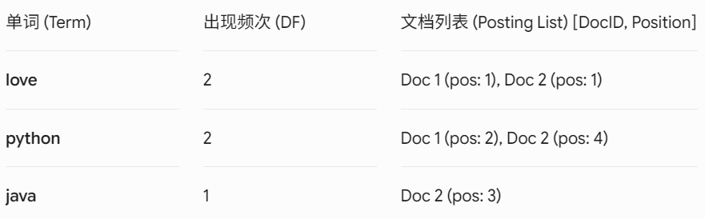
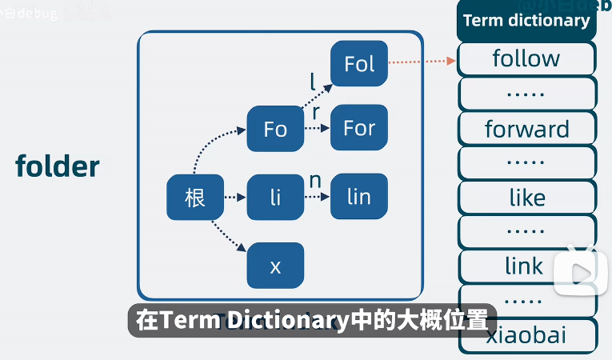

# SQL 与 Elasticsearch：数据存储与搜索怎么分工

## SQL 常见语法
```sql
SELECT 姓名，班级，成绩 
FROM students 
WHERE 班级=‘1年级2班’
LIMIT 5 
OFFSET 5;
```
>1. students：表名
>2. OFFSET：
#### Elasticsearch 和 MySQL
mysql就像书架，找某个东西要一排一排找，ES就像图书馆管理系统，搜索某个书它立马就能告诉书在哪，还会把最相关的排在最前面
- Elasticsearch：数据检索与分析，**速度、灵活**，数据以json格式存储
	1. **倒排索引**（Inverted Index）：正向索引是通过文档ID找内容，倒排索引是**通过要查的关键词找文档**
	2. **全文检索**
	有一个分词器把文档分词、转小写、去停用词（and、I...），形成一个倒排索引表
	
	当搜索单词的时候直接查表
- MySQL：数据存储与事务管理，严禁，就像excel表格，以关系型存储（表、行、列）
- **MySQL和ES数据怎么同步**：
	根据业务对实时性和系统复杂度的要求来选择方案
	1. 双写：每次对数据库有增删改操作的时候同时向ES也发送一份请求（最简单）
	2. 定时任务：每隔一段时间更新一次（有延迟，对数据库也有压力）
	3. CDC / 读 Binlog 方案：比如说用**Canal**，类似于给MySQL装一个监控，Mysql里的数据一变，变更日志就会立马被canal捕捉到然后发送给ES

#### Elasticsearch
ES分布式搜索引擎，介于应用和数据之间，检索海量数据。可以实现实现搜索、日志统计、分析、系统监控等功能
- **倒排索引**：有一个分词器把文档分词、转小写、去停用词（and、I...），形成一个倒排索引表
	
	当搜索单词的时候直接查表（获得的是**文档ID**，文档存放在Stored Fields里），用**二分查找**的方法
	- 构建词表：用于搜索
		词太多了的时候把前缀相同的放一块，搜索的时候检索这个index，就能快速获得在词项中的大概位置，再跳转到term dictionary（加速搜索）通过少量检索就能快速定位
	- Doc Values：列式存储，对找出来的文档进行高效的排序和统计
- **Lucene**：
	每一个ES分片本质上就是一个完整的Lucene检索实例，核心是**倒排索引**
	对文档进行分词，然后去掉一些停用词，生成一个词表，就是每个词对应的在哪个文档里出现。当我们搜词的时候是通过关键词搜到文档，然后通过**BM25 算法**算分之后返回最相近的文档。
	- 步骤：
	1. 查倒排索引表（类似 HashMap）
	2. 拿到 DocID 列表
	3. 直接取文档
