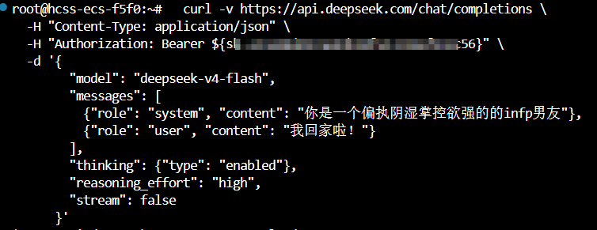

# 计算机网络与操作系统：服务为什么能跑起来

#### TCP/IP四层模型
1. 网络接口层
2. 网际层，核心是IP协议
3. 传输层，核心是TCP和UCP
4. 应用层

#### OSI七层模型
物联网叔会使用
1. 物理层：数据变成信号
	设备：中继器和集线器
2. 数据链路层：信号封装成帧
	设备：网桥，交换机
3. 网络层：数据打包成数据报
	设备：路由器
4. 传输层：端到端通信：TCP/UDP
5. 会话层：建立/管理/断开会话
6. 表示层：翻译、压缩、TLS/SSL
7. 应用层：提供服务


### 网络分类
- 个人局域网**PAN** personal：几米，比如蓝牙连接
- 局域网**LAN**local：通常在几公里以内
	- 传输速率高（千兆/万兆以太网）、误码率极低，维护成本较低，且通常为私有所有（归单个组织管理）
	- 早期局域网采用**广播技术**，一个设备发送数据所有设备都能收到，早期局域网所有电脑连在一根总线上通过CSMA/CD（**载波监听多路访问/冲突检测**）来争抢信道
		- **IEEE802系列**：
		1. IEEE802.3：以太网的标准，采用CSMA/CD载波监听多路访问/冲突检测
		2. IEEE802.4：令牌总线的标准
		3. IEEE802.5：令牌环网
		4. IEEE802.6：城域网
- 城域网**MAN** metropolitian：覆盖一个城市或都会区
	- 比局域网范围大，比广域网速度快（通常采用光纤），常作为连接该城市内多个局域网的“骨干桥梁”
- 广域网**WAN** wide：覆盖国家、大洲乃至全球
	- 传输速率相对较低（受限于长距离物理损耗）、延迟较大、误码率较高，且通常需要向运营商租用线路
	- 早期广域网采用**交换技术**，类似快递中转站，中间经过路由器或交换机，每个节点根据目标地址将数据转发到对应的端口

##### 私有地址
三大段：
1. A类私有：10.0.0.0~10.255.255.255，子网掩码：/8
2. B类私有：172.16.0.0~172.31.255.255，子网掩码：/12
3. C类私有：192.168.0.0~192.168.255.255，子网掩码：/16

### 网络互连设备
- 中继器：物理层，**放大和再生信号**，延长传输距离（单纯处理电信号/光信号，不识别数据内容），类似于喊话时的扩音器。**只有 2 个端口**（1进1出）
- 集线器：多端口的中继器，物理层，信号再生与放大。**通常有 4~24 个端口**（多进多出）
- 网桥/交换机：数据链路层，连接两个相同或相似的网络，根据MAC（物理地址）过滤和转发数据帧
- 路由器：网络层，连接不同地址，根据IP地址


### PPP协议
点对点协议Point-to-Point Protocol，是**数据链路层**的
两个设备之间一对一直连
- 应用场景：


#### IPV4/IPV6
-  隧道技术
	把IPV6数据包包裹起来原封不动塞进IPV4数据包的数据部分，以IPV4的身份继续传输，到终点后再解封还原
	常用技术：6to4、ISATAP、Teredo

#### TCP/IP协议
- TCP首部：20字节
	UDP首部：8字节
- IPv4首部：20字节
**TCP/IP 协议栈的封装开销**：n（应用数据）+ 20（TCP首部）+ 20（IP首部）

#### TCP 三次握手四次挥手
- 三次握手：
	1. 客户端发送请求连接的报文
	2. 服务端回复确认收到，自己也发起连接请求
	3. 客户端再回复确认收到
- 四次挥手：
	1. 客户端请求断开连接
	2. 服务端确认可以断开连接，这个时候服务端依旧可以传输剩下的数据
	3. 服务端把数据发完之后再发送一个关闭请求
	4. 客户端收到，彻底断开

#### UDP
用户数据包协议，是一个轻便飞速的**传输层**协议，头部只有**8个字节**，很简单快速轻量
- 特点：
	- 无连接：不需要三次握手建立链路，直接封装好数据包就丢到网上了
	- 不可靠交付：发出去之后就不管了，可能会丢失数据包
	- 面向报文：UDP对于应用层送下来的数据，既不拆分，也不合并，直接原样封装在UDP报文里交给IP层
- 应用场景：微信视频聊天、游戏等，掉一两帧没啥事的

#### TCP/UDP区别
TCP面向连接，可靠，准确性高，但是开销大
UDP是无连接，不可靠，延迟低


#### ICMP互联网控制报文协议
网络层协议，负责传递**网络错误报告和诊断信息**
eg：ping和tracert


## 应用层
##### 万维网WWW
- URL：网址
- HTTP/HTTPS：超文本传输协议，传输规则
	- HTTP：超文本传输协议，基于TCP明文传输，明文传输，不加密。
		- 端口：80
	- HTTPS：HTTP+TLS，通过TLS加密的HTTP，提供安全性，HTTPS 解决窃听、篡改、身份伪装
		- 端口：443
- HTML：内容展示

##### HTTP
- 请求：
	curl -v 'http://......' ：不仅访问还把响应的所有内容都发送过来
```
	请求行
	请求头-H...(不自己定义的就会自动定义)
		常见请求头：
		1.HOST：我找哪台机器
		2.user-Agent：我是哪个浏览器/机器...
		3.Authorization：身份凭证，apikey就在里面
		4.cookie
	空行
	请求体-d...（curl默认发get，但是如果有-d有请求体要提交就变成post）
	
```

- 响应：
```
状态行：有状态码
	egHTTP/1.2 200 OK
	4开头是请求方的问题，5开头是服务方问题
响应头：
	content-type必写
空行
响应体
```
- HTTP从前端传到后端：
	1. 前端发起请求，先DNS域名解析，拿到目标服务器IP
	2. TCP三次握手，如果是HTTPS的话还需要走TLS加密，构造http请求（包括请求行请求头空格请求体），通过tcp发送给服务端
	3. 请求到达服务器之后经过反向代理再交给后端服务，后端接收请求之后解析报文，执行，返回http响应，通过tcp传给前端
	4. 浏览器收到之后解析响应渲染画面或者处理数据，TCP四次挥手断开连接


##### 常见端口
- 远程登陆/管理
	1. SSH：22
	2. Telnet：23 远程登录（明文，不安全）
	3. RDP：3389 Windows远程桌面协议
- Web服务
	1. HTTP：80 超文本传输（明文）
	2. HTTPS：443 超文本传输（SSL/TLS加密）
- 文件传输
	1. FTP（控制）：21 控制命令传输
	2. FTP（数据）：20 实际文件数据传输
- 电子邮件
	1. SMTP：25 发信
	2. POP3：110 收信
- 网络基础服务
	1. DNS：53 域名解析（域名转IP
	2. DHCP（服务器）：67 自动分配IP地址
	3. DHCP（客户端）：68 接收IP配置


## 攻击手段
1. DNS挟持：**把域名翻译成地址**。挟持之后跳转别的网页
2. DDos攻击：分布式拒绝服务攻击，使用海量垃圾流量淹没目标服务器
3. MAC地址欺骗：欺骗局域网内的交换机，伪造身份证（MAC地址）绕过交换机的检查（IP/MAC绑定）
4. 伪造DHCP服务器


# 二、操作系统

资源管理者
### 四大特征
1. 并发：在同一段时间内交替执行。宏观上同时，微观上交替
	并行是同时运行
2. 共享：多个程序共同使用资源
	1. 互斥共享：一次只能一个程序使用
	2. 同时共享：多个程序一起使用
	共享和并发互相依存
3. 虚拟：把一个东西变得好像有很多个
	1. 空分复用技术
	2. 时分复用技术
4. 异步：程序运行快慢不确定
### 进程、线程和协程
- 进程：资源分配的最小单位
- 线程：CPU调度的最小单位
- 协程：运行在线程，**用户态**的轻量级执行单元，适合处理大量不太紧急的工作，适合 IO密集型任务

- 线程和协程区别：
	1. 调度方不同，线程是操作系统内核调度，协程是用户态调度
	2. 切换开销上线程会触发系统上下文切换，开销比较大，协程仅保存少量上下文，开销小
	3. 阻塞的处理逻辑不同，线程阻塞会自动切换其余就绪的线程，协程阻塞的时候必须主动让出执行权，否则卡住
- 为什么引入协程：
	1. 多线程开销比较大，没办法利用多核做CPU密集计算


#### 分布式任务
基于redis实现分布式锁，设置key并且携带过期时间获取锁，任务完成就主动删除key释放锁


